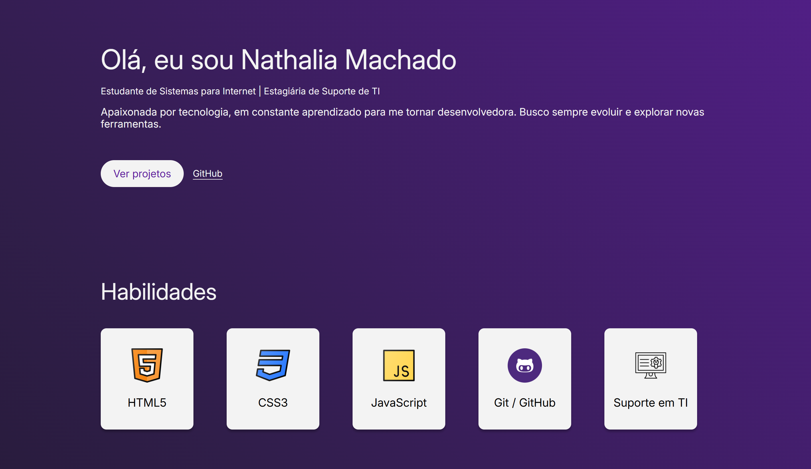

<h1 align="center">Portfólio</h1>

## 📋 Descrição do projeto

Este é meu **portfólio pessoal**, desenvolvido para apresentar minhas **habilidades, projetos e trajetória profissional**.  
O site foi construído com **HTML**, **CSS** e **JavaScript**, possui design responsivo e alternância entre tema claro e escuro (dark/light mode).  

- O portfólio inclui seções de **Home**, **Skills**, **Projetos**, **Sobre mim** e **Contato**.

- O projeto foi desenvolvido durante o Bootcamp Front-end 2025 da <a href="https://web.dio.me/track/9179a4c1-edae-47fa-bdbb-1be72012f9c7">DIO + Santander</a>.

## 🚀 Funcionalidades

- Alternância entre tema **claro** e **escuro**  
- Seção **Home** com apresentação pessoal  
- Seção **Skills** com minhas principais habilidades  
- Seção **Projetos** com links para repositórios e deploys  
- Seção **Sobre mim** com formação acadêmica e experiência profissional  
- Seção **Contato** com links para GitHub, LinkedIn e Discord  

---

## 💻 Projetos

### 1. Pokédex
- Projeto de estudo em **JavaScript** utilizando a [PokéAPI](https://pokeapi.co/) para listar e detalhar Pokémon.  
- Desenvolvido durante o Bootcamp da [DIO](https://web.dio.me/home).  
- 🔗 [Visualizar Projeto](https://nathxrz.github.io/pokedex-dio/)  
- 🔗 [Repositório](https://github.com/nathxrz/pokedex-dio/tree/main)

### 2. Spotify
- Home page desenvolvida durante a imersão front-end da [Alura](https://www.alura.com.br/).  
- 🔗 [Visualizar Projeto](https://nathxrz.github.io/imersao-alura-front-end/)  
- 🔗 [Repositório](https://github.com/nathxrz/imersao-alura-front-end)

### 3. Radar Literário
- Plataforma de pesquisa de livros com sinopse e autor, desenvolvida em **HTML, CSS e JavaScript** durante a imersão [Alura + Gemini](https://gemini.google.com/app?hl=pt-BR).  
- 🔗 [Visualizar Projeto](https://imersao-alura-gemini-mocha.vercel.app/)  
- 🔗 [Repositório](https://github.com/nathxrz/imersao-alura-gemini)

### 4. Jogo da Adivinhação
- Projeto interativo em **JavaScript** para prática de manipulação de dados e geração de números aleatórios.  
- 🔗 [Visualizar Projeto](https://nathxrz.github.io/TrilhaExplorer-projeto-6/)  
- 🔗 [Repositório](https://github.com/nathxrz/TrilhaExplorer-projeto-6)

### 5. Calendário da Copa
- Projeto com **HTML, CSS e JS**, aplicando semântica, responsividade e manipulação dinâmica de elementos.  
- 🔗 [Visualizar Projeto](https://nathxrz.github.io/nlw-copa22/)  
- 🔗 [Repositório](https://github.com/nathxrz/nlw-copa22)

### 6. Biscoito da Sorte
- Página interativa que sorteia mensagens ao clicar no biscoito, aplicando **DOM e geração aleatória**.  
- 🔗 [Visualizar Projeto](https://nathxrz.github.io/TrilhaExplorer-projeto-7/)  
- 🔗 [Repositório](https://github.com/nathxrz/TrilhaExplorer-projeto-7)

---

## 🛠️ Tecnologias utilizadas

- **HTML5**  
- **CSS3**  
- **JavaScript (ES6+)**  
- **Google Fonts**  
- **Material Symbols**  

---

## 💻 Protótipo
🔗 [Clique aqui para acessar](https://nathxrz.github.io/portfolio/)

## 📩 Contato

- 📧 Email: nathyrezendemachado@gmail.com  
- 💼 [LinkedIn](https://www.linkedin.com/in/nathalia-machado-021b1b230/)  
- 🌐 [GitHub](https://github.com/nathxrz)  
- 💬 [Discord](https://discord.com/users/nathx9059)  

---

✨ Desenvolvido por **Nathalia Machado**